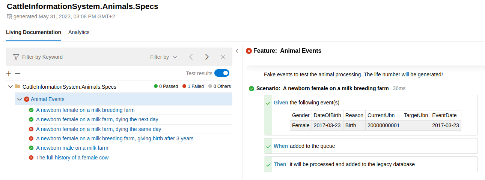

# Living In Your Own Bubble

This is the demo application for my talk 'Living in Your Own Bubble - From Legacy to Domain Driven Design', for the Domain Driven Design Europe 2023 conference. There are two applications, the legacy, database-oriented application and a 'Bubble Context' to handle animal events.


## Running the application
Just run the command below to start the application. Make sure you have nothing running on port 80 or change the web port in the `docker-compose.yml` file.
```shell
docker-compose up
```

The web application will be accessible on 'http://localhost' (if all goes well).

## Cattle Information System

This application is created to help with rebuilding a legacy system. It makes sure the database functions are created and it can be used to execute specifications (SpecFlow), which are test scenario's. They can also be used to demonstrate the working of the processing of animal events with the database functions.


## Cattle Information System - Animals

This application is a worker, with a subscription on a RabbitMq topic. There are also some specifications (SpecFlow), which can be used as input and test scenario's.



## Cattle Information System - Shared Kernel

A few models are shared with between the legacy application and the bubble context.

## Sources

* [GETTING STARTED WITH DDD WHEN SURROUNDED BY LEGACY SYSTEMS - By Eric Evans](https://www.domainlanguage.com/wp-content/uploads/2016/04/GettingStartedWithDDDWhenSurroundedByLegacySystemsV1.pdf)


